# secure-api-lab

## Опис API

Цей серверний застосунок реалізує простий REST API для керування документами. API дозволяє отримувати список документів, переглядати конкретні записи, створювати нові, оновлювати існуючі та видаляти непотрібні.

Доступ до API захищено за допомогою базової авторизації через заголовки X-Login та X-Password. Крім того, сервер веде журнал усіх запитів, що дозволяє відстежувати звернення та спрощує налагодження системи.

## Встановлення та запуск

- Встановіть залежності:
```bash
npm install
```

- Запустіть сервер:
```bash
npm start
```
- Сервер буде доступний за адресою:
```bash
[npm install](http://localhost:3000)
```

## Запуск тестового клієнта

Для перевірки роботи API передбачено скрипт test-client.js, який автоматично виконує кілька запитів до сервера з різними обліковими даними (користувач та адміністратор).

- Переконайтеся, що сервер запущено командою:
```bash
npm start
```
- У новому терміналі запустіть тестовий клієнт:
```bash
npm test
```
- У консолі з’являться результати виконання трьох тестових сценаріїв.

## Реалізовані ендпоінти API

| HTTP-метод | URL | Опис | Необхідні заголовки | Тіло запиту (для POST) | Можливі коди відповіді |
|-------------|------|------|----------------------|--------------------------|--------------------------|
| **GET** | `/documents` | Отримати список усіх документів | `X-Login`, `X-Password` | — | `200 OK` — успішно<br>`401 Unauthorized` — неправильні облікові дані |
| **POST** | `/documents` | Додати новий документ | `X-Login`, `X-Password` | ```json { "title": "Contract", "content": "Text of document" } ``` | `201 Created` — документ створено<br>`400 Bad Request` — некоректні дані<br>`401 Unauthorized` — доступ заборонено |
| **PUT** | `/documents/:id` | Оновити документ за ID | `X-Login`, `X-Password` | ```json { "title": "Updated title", "content": "Updated text" } ``` | `200 OK` — оновлено<br>`400 Bad Request` — некоректні дані<br>`404 Not Found` — не знайдено |
| **DELETE** | `/documents/:id` | Видалити документ за ID | `X-Login`, `X-Password` | — | `200 OK` — видалено<br>`404 Not Found` — не знайдено |
| **GET** | `/employees` | Отримати список працівників (доступно лише адміну) | `X-Login`, `X-Password` | — | `200 OK` — успішно<br>`403 Forbidden` — доступ лише для адміністратора<br>`401 Unauthorized` — неправильні дані |

## Посилання на репозиторій

[secure-api-lab — GitHub Repository](https://github.com/ignsofa/secure-api-lab)


## Screenshots:

Task 2

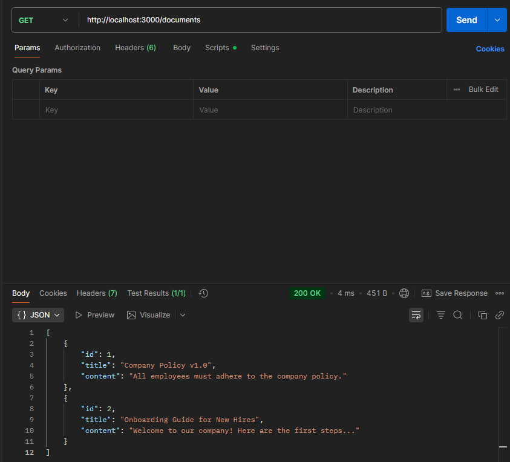

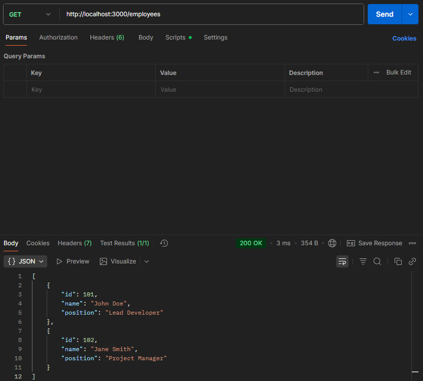

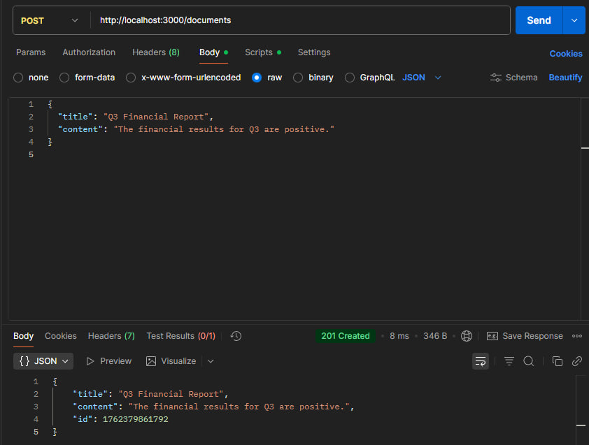

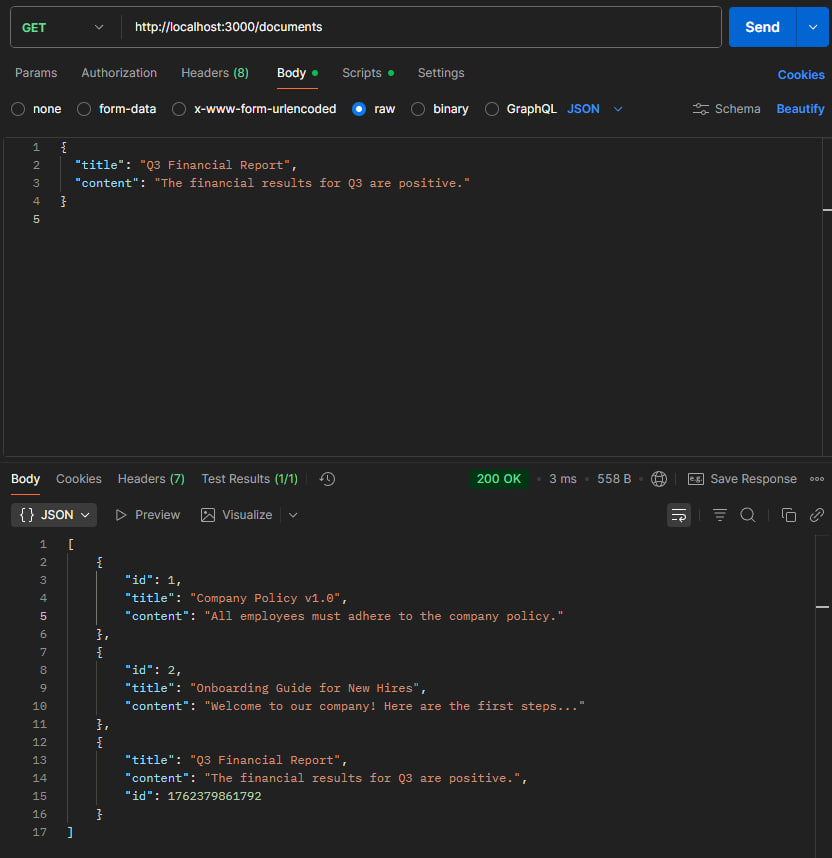

Task 3

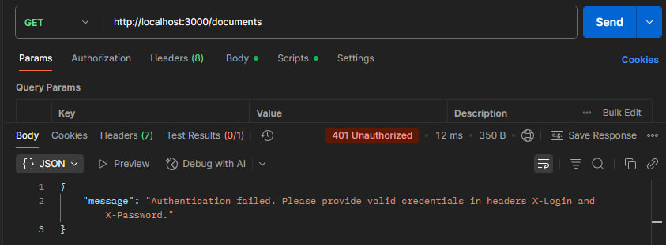

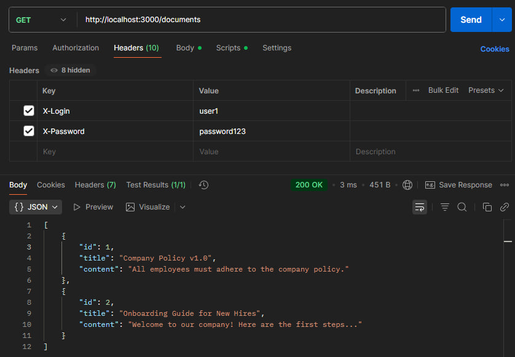

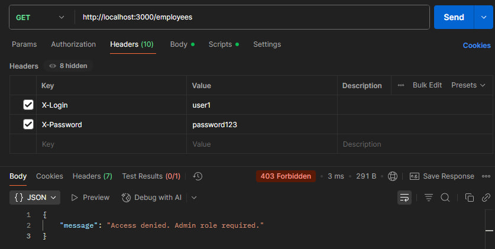

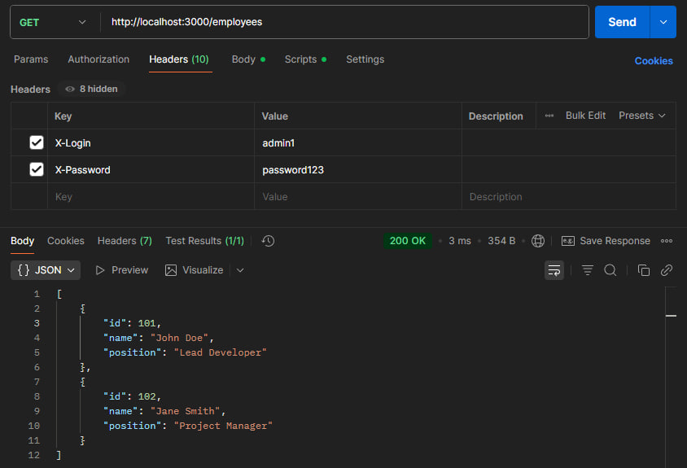

Task 4


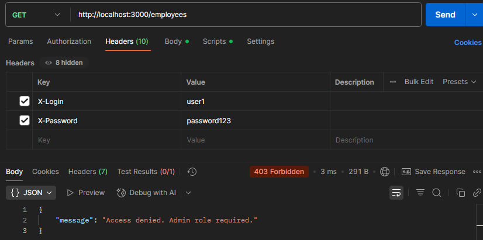

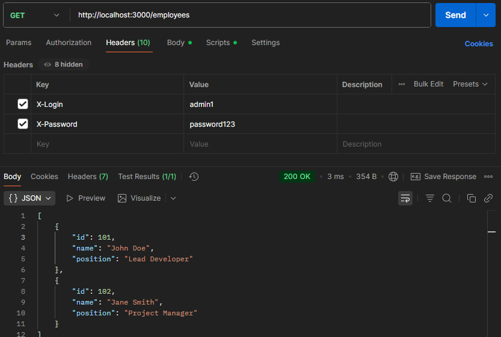

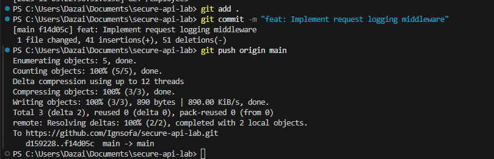

Task 5


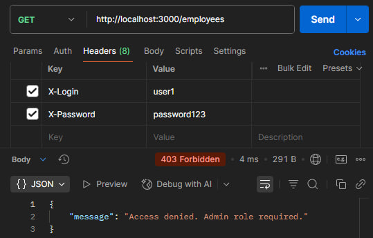

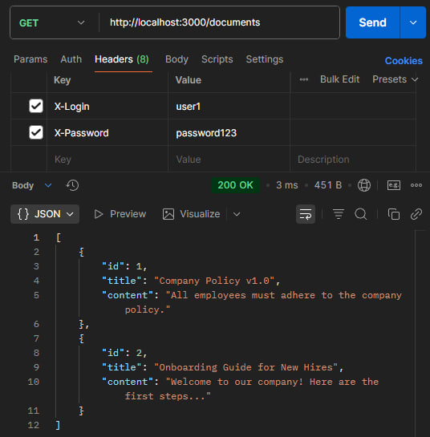

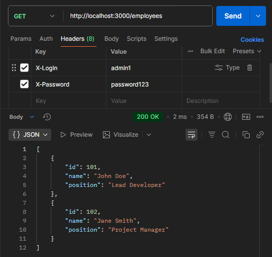

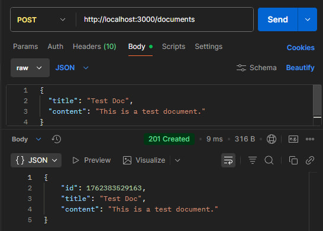

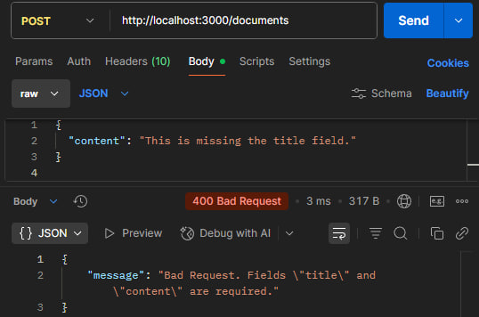

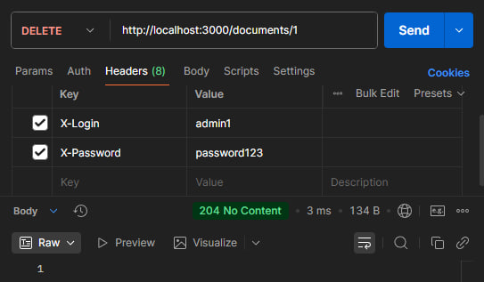

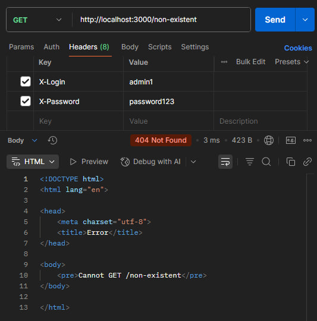

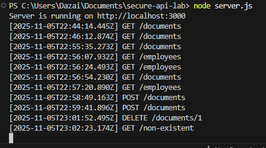
